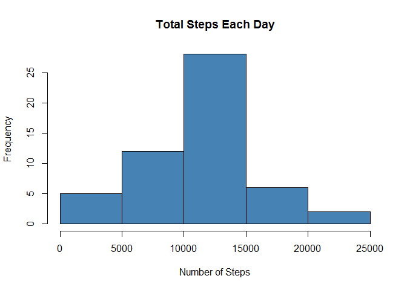
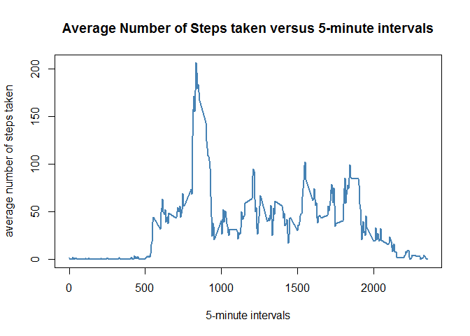
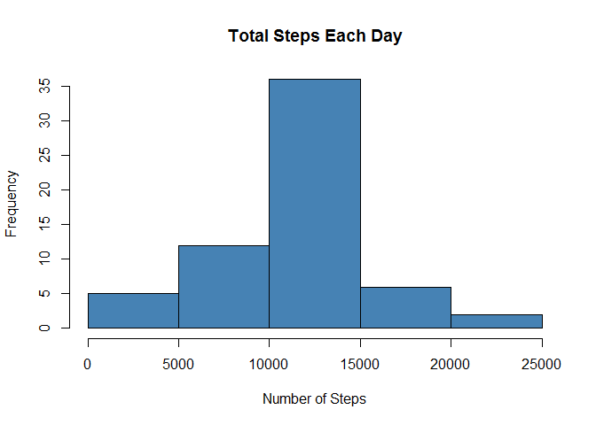
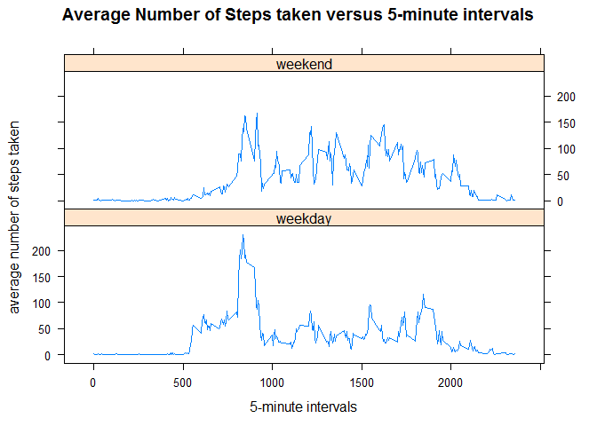

# Reproducible Research: Peer Assessment 1


## Loading and preprocessing the data

```r
echo = TRUE #make the code visible
unzip("activity.zip")
data <- read.csv("activity.csv") #load and read the data
head(data)
```

```
##   steps       date interval
## 1    NA 2012-10-01        0
## 2    NA 2012-10-01        5
## 3    NA 2012-10-01       10
## 4    NA 2012-10-01       15
## 5    NA 2012-10-01       20
## 6    NA 2012-10-01       25
```

```r
tail(data)
```

```
##       steps       date interval
## 17563    NA 2012-11-30     2330
## 17564    NA 2012-11-30     2335
## 17565    NA 2012-11-30     2340
## 17566    NA 2012-11-30     2345
## 17567    NA 2012-11-30     2350
## 17568    NA 2012-11-30     2355
```

```r
summary(data)
```

```
##      steps                date          interval     
##  Min.   :  0.00   2012-10-01:  288   Min.   :   0.0  
##  1st Qu.:  0.00   2012-10-02:  288   1st Qu.: 588.8  
##  Median :  0.00   2012-10-03:  288   Median :1177.5  
##  Mean   : 37.38   2012-10-04:  288   Mean   :1177.5  
##  3rd Qu.: 12.00   2012-10-05:  288   3rd Qu.:1766.2  
##  Max.   :806.00   2012-10-06:  288   Max.   :2355.0  
##  NA's   :2304     (Other)   :15840
```

```r
class(data)
```

```
## [1] "data.frame"
```

```r
str(data)
```

```
## 'data.frame':	17568 obs. of  3 variables:
##  $ steps   : int  NA NA NA NA NA NA NA NA NA NA ...
##  $ date    : Factor w/ 61 levels "2012-10-01","2012-10-02",..: 1 1 1 1 1 1 1 1 1 1 ...
##  $ interval: int  0 5 10 15 20 25 30 35 40 45 ...
```

## What is mean total number of steps taken per day?
For this part of the assignment, I ignore the missing values in the dataset. 

### Calculate the total number of steps taken per day

```r
steps_date <- aggregate(steps ~ date, data, sum, na.action = na.omit)
head(steps_date)
```

```
##         date steps
## 1 2012-10-02   126
## 2 2012-10-03 11352
## 3 2012-10-04 12116
## 4 2012-10-05 13294
## 5 2012-10-06 15420
## 6 2012-10-07 11015
```

```r
tail(steps_date)
```

```
##          date steps
## 48 2012-11-24 14478
## 49 2012-11-25 11834
## 50 2012-11-26 11162
## 51 2012-11-27 13646
## 52 2012-11-28 10183
## 53 2012-11-29  7047
```

```r
hist(steps_date$steps, main = paste("Total Steps Each Day"), col="steelblue", xlab="Number of Steps")
```

 

### Calculate and report the mean and median of the total number of steps taken per day
* The mean of the total number of steps taken per day: 

```r
mean(steps_date$steps)
```

```
## [1] 10766.19
```
* The median of the total number of steps taken per day: 

```r
median(steps_date$steps)
```

```
## [1] 10765
```


## What is the average daily activity pattern?

### a time series plot of the average number of steps taken versus the 5-minute intervals. 

```r
mean_steps_interval <- aggregate(steps ~ interval, data, mean,na.action = na.omit)
head(mean_steps_interval)
```

```
##   interval     steps
## 1        0 1.7169811
## 2        5 0.3396226
## 3       10 0.1320755
## 4       15 0.1509434
## 5       20 0.0754717
## 6       25 2.0943396
```

```r
plot(mean_steps_interval$interval,mean_steps_interval$steps, type="l", col = "steelblue",lwd = 2,xlab="5-minute intervals", ylab="average number of steps taken",main="Average Number of Steps taken versus 5-minute intervals")
```

 

### 5-minute interval contains the maximum number of steps

```r
mean_steps_interval[mean_steps_interval$steps == max(mean_steps_interval$steps), ]
```

```
##     interval    steps
## 104      835 206.1698
```


## Imputing missing values

```r
summary(data)
```

```
##      steps                date          interval     
##  Min.   :  0.00   2012-10-01:  288   Min.   :   0.0  
##  1st Qu.:  0.00   2012-10-02:  288   1st Qu.: 588.8  
##  Median :  0.00   2012-10-03:  288   Median :1177.5  
##  Mean   : 37.38   2012-10-04:  288   Mean   :1177.5  
##  3rd Qu.: 12.00   2012-10-05:  288   3rd Qu.:1766.2  
##  Max.   :806.00   2012-10-06:  288   Max.   :2355.0  
##  NA's   :2304     (Other)   :15840
```
From the summry of the data, we can tell that there are 2304 NA's. 
We can also caculate it: 

```r
nrow(data[!complete.cases(data),])
```

```
## [1] 2304
```
### The strategy for filling all the missing values in the datasets 

Replacing the NA steps values with the average number of steps taken of the corresponding intervals as calculated above

```r
no_NA_data<-data
sapply(unique(data$interval),function(x)no_NA_data[!complete.cases(no_NA_data)&(no_NA_data$interval==x),1]<<-mean_steps_interval$steps[mean_steps_interval$interval==x])
```

```
##   [1]   1.7169811   0.3396226   0.1320755   0.1509434   0.0754717
##   [6]   2.0943396   0.5283019   0.8679245   0.0000000   1.4716981
##  [11]   0.3018868   0.1320755   0.3207547   0.6792453   0.1509434
##  [16]   0.3396226   0.0000000   1.1132075   1.8301887   0.1698113
##  [21]   0.1698113   0.3773585   0.2641509   0.0000000   0.0000000
##  [26]   0.0000000   1.1320755   0.0000000   0.0000000   0.1320755
##  [31]   0.0000000   0.2264151   0.0000000   0.0000000   1.5471698
##  [36]   0.9433962   0.0000000   0.0000000   0.0000000   0.0000000
##  [41]   0.2075472   0.6226415   1.6226415   0.5849057   0.4905660
##  [46]   0.0754717   0.0000000   0.0000000   1.1886792   0.9433962
##  [51]   2.5660377   0.0000000   0.3396226   0.3584906   4.1132075
##  [56]   0.6603774   3.4905660   0.8301887   3.1132075   1.1132075
##  [61]   0.0000000   1.5660377   3.0000000   2.2452830   3.3207547
##  [66]   2.9622642   2.0943396   6.0566038  16.0188679  18.3396226
##  [71]  39.4528302  44.4905660  31.4905660  49.2641509  53.7735849
##  [76]  63.4528302  49.9622642  47.0754717  52.1509434  39.3396226
##  [81]  44.0188679  44.1698113  37.3584906  49.0377358  43.8113208
##  [86]  44.3773585  50.5094340  54.5094340  49.9245283  50.9811321
##  [91]  55.6792453  44.3207547  52.2641509  69.5471698  57.8490566
##  [96]  56.1509434  73.3773585  68.2075472 129.4339623 157.5283019
## [101] 171.1509434 155.3962264 177.3018868 206.1698113 195.9245283
## [106] 179.5660377 183.3962264 167.0188679 143.4528302 124.0377358
## [111] 109.1132075 108.1132075 103.7169811  95.9622642  66.2075472
## [116]  45.2264151  24.7924528  38.7547170  34.9811321  21.0566038
## [121]  40.5660377  26.9811321  42.4150943  52.6603774  38.9245283
## [126]  50.7924528  44.2830189  37.4150943  34.6981132  28.3396226
## [131]  25.0943396  31.9433962  31.3584906  29.6792453  21.3207547
## [136]  25.5471698  28.3773585  26.4716981  33.4339623  49.9811321
## [141]  42.0377358  44.6037736  46.0377358  59.1886792  63.8679245
## [146]  87.6981132  94.8490566  92.7735849  63.3962264  50.1698113
## [151]  54.4716981  32.4150943  26.5283019  37.7358491  45.0566038
## [156]  67.2830189  42.3396226  39.8867925  43.2641509  40.9811321
## [161]  46.2452830  56.4339623  42.7547170  25.1320755  39.9622642
## [166]  53.5471698  47.3207547  60.8113208  55.7547170  51.9622642
## [171]  43.5849057  48.6981132  35.4716981  37.5471698  41.8490566
## [176]  27.5094340  17.1132075  26.0754717  43.6226415  43.7735849
## [181]  30.0188679  36.0754717  35.4905660  38.8490566  45.9622642
## [186]  47.7547170  48.1320755  65.3207547  82.9056604  98.6603774
## [191] 102.1132075  83.9622642  62.1320755  64.1320755  74.5471698
## [196]  63.1698113  56.9056604  59.7735849  43.8679245  38.5660377
## [201]  44.6603774  45.4528302  46.2075472  43.6792453  46.6226415
## [206]  56.3018868  50.7169811  61.2264151  72.7169811  78.9433962
## [211]  68.9433962  59.6603774  75.0943396  56.5094340  34.7735849
## [216]  37.4528302  40.6792453  58.0188679  74.6981132  85.3207547
## [221]  59.2641509  67.7735849  77.6981132  74.2452830  85.3396226
## [226]  99.4528302  86.5849057  85.6037736  84.8679245  77.8301887
## [231]  58.0377358  53.3584906  36.3207547  20.7169811  27.3962264
## [236]  40.0188679  30.2075472  25.5471698  45.6603774  33.5283019
## [241]  19.6226415  19.0188679  19.3396226  33.3396226  26.8113208
## [246]  21.1698113  27.3018868  21.3396226  19.5471698  21.3207547
## [251]  32.3018868  20.1509434  15.9433962  17.2264151  23.4528302
## [256]  19.2452830  12.4528302   8.0188679  14.6603774  16.3018868
## [261]   8.6792453   7.7924528   8.1320755   2.6226415   1.4528302
## [266]   3.6792453   4.8113208   8.5094340   7.0754717   8.6981132
## [271]   9.7547170   2.2075472   0.3207547   0.1132075   1.6037736
## [276]   4.6037736   3.3018868   2.8490566   0.0000000   0.8301887
## [281]   0.9622642   1.5849057   2.6037736   4.6981132   3.3018868
## [286]   0.6415094   0.2264151   1.0754717
```
no_NA_data is a new dataset that is euqal to the original data set but with the missing data filled in. 

```r
head(no_NA_data)
```

```
##       steps       date interval
## 1 1.7169811 2012-10-01        0
## 2 0.3396226 2012-10-01        5
## 3 0.1320755 2012-10-01       10
## 4 0.1509434 2012-10-01       15
## 5 0.0754717 2012-10-01       20
## 6 2.0943396 2012-10-01       25
```
### A histogram of the total number of steps taken each day after missing values were imputed


```r
new_steps_date <- aggregate(steps ~ date, no_NA_data, sum)
hist(new_steps_date$steps, main = paste("Total Steps Each Day"), col="steelblue", xlab="Number of Steps")
```

 

* The mean of the total number of steps taken per day after missing data filled in: 

```r
mean(new_steps_date$steps)
```

```
## [1] 10766.19
```

* The median of the total number of steps taken per day after missing data filled in: 

```r
median(new_steps_date$steps)
```

```
## [1] 10766.19
```

* Calculate the difference before and after missing data filled in

```r
mean(steps_date$steps)-mean(new_steps_date$steps)
```

```
## [1] 0
```

```r
median(steps_date$steps)-median(new_steps_date$steps)
```

```
## [1] -1.188679
```
There is no difference for the mean, a slightly difference for the median.

## Are there differences in activity patterns between weekdays and weekends?

```r
no_NA_data$date <- as.Date(no_NA_data$date, "%Y-%m-%d") ## change the date formate from factor to date
no_NA_data$work_or_not<-"weekday" ##assign everyday as weekday
no_NA_data$work_or_not[weekdays(no_NA_data$date)%in%c("Saturday","Sunday")]<-"weekend" ##assign days are weekends
no_NA_data$work_or_not<-as.factor(no_NA_data$work_or_not)
head(no_NA_data)
```

```
##       steps       date interval work_or_not
## 1 1.7169811 2012-10-01        0     weekday
## 2 0.3396226 2012-10-01        5     weekday
## 3 0.1320755 2012-10-01       10     weekday
## 4 0.1509434 2012-10-01       15     weekday
## 5 0.0754717 2012-10-01       20     weekday
## 6 2.0943396 2012-10-01       25     weekday
```

```r
steps_by_interval<- aggregate(steps ~ interval + work_or_not, no_NA_data, mean)

library(lattice)

xyplot(steps_by_interval$steps ~ steps_by_interval$interval|steps_by_interval$work_or_not, main="Average Number of Steps taken versus 5-minute intervals",xlab="5-minute intervals", ylab="average number of steps taken",layout=c(1,2), type="l")
```

 
